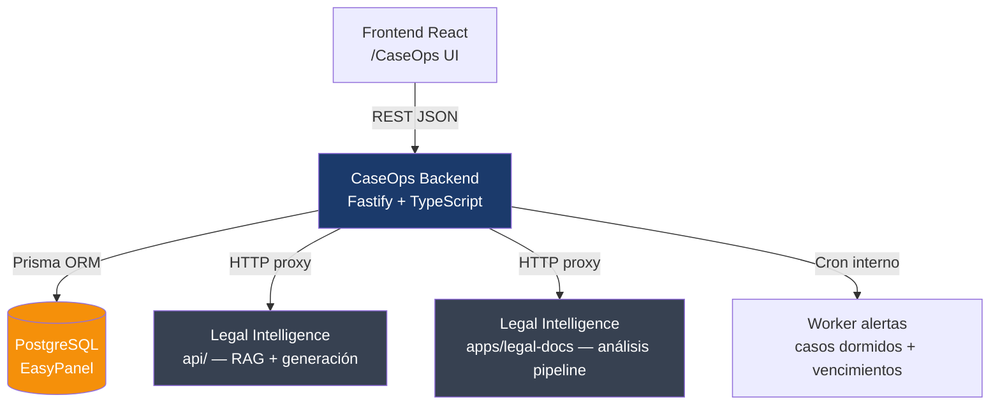

## Objetivo

Construir el backend de CaseOps como un servicio Node.js independiente dentro del mismo repo (`/backend`), con API REST que alimenta la UI existente y se comunica con Legal Intelligence vía HTTP.

---

## Arquitectura general



---

## Stack

| Capa | Tecnología |
|---|---|
| Runtime | Node.js 20 + TypeScript |
| Framework | **Fastify** (performance, schemas nativos) |
| ORM | **Prisma** (type-safe, migraciones) |
| Base de datos | **PostgreSQL 16** (EasyPanel) |
| Auth | **JWT** (access token 8h + refresh token 7d) |
| Validación | **Zod** (schemas compartibles con el frontend) |
| Alertas/Cron | `node-cron` (proceso interno, sin dependencias externas) |
| Docs | Fastify Swagger (auto-generado) |
| Deploy | Dockerfile propio en `/backend` |

---

## Estructura de carpetas

```
/backend
  prisma/
    schema.prisma          ← definición de entidades
    migrations/            ← migraciones auto-generadas
    seed.ts                ← datos iniciales (roles, usuario admin)
  src/
    server.ts              ← entry point Fastify
    config.ts              ← variables de entorno (zod-validated)
    plugins/
      auth.ts              ← JWT plugin, decoradores request.user
      cors.ts
      swagger.ts
    routes/
      auth.ts              ← POST /auth/login, /auth/refresh, /auth/me
      cases.ts             ← CRUD casos
      clients.ts           ← CRUD clientes
      tasks.ts             ← CRUD tareas
      documents.ts         ← metadata docs + proxy upload Legal Intel
      notes.ts             ← notas internas
      users.ts             ← gestión usuarios (admin)
      alerts.ts            ← GET /alerts (casos dormidos, vencidos)
      legal-intel.ts       ← proxy hacia Legal Intelligence API
    services/
      case.service.ts
      timeline.service.ts  ← registra evento en historial automáticamente
      alert.service.ts     ← lógica de detección dormidos/vencidos
      legal-intel.service.ts ← HTTP client hacia LI
    workers/
      alerts.worker.ts     ← cron cada hora: detecta y persiste alertas
    middleware/
      roles.ts             ← guard por rol en cada ruta
    utils/
      case-id.ts           ← generador MR-YYYY-NNNNN
  Dockerfile
  .env.example
```

---

## Schema Prisma — entidades principales

```
User           → id, email, passwordHash, name, role, active
Case           → id, caseId(MR-...), title, materia, subtype, status, stage, priority,
                 channel, assignedLawyerId, coordinatorId, clientId,
                 summary, nextAction, nextActionDate, isDormant, isUrgent,
                 createdAt, lastActivity
Client         → id, name, dni, phone, email, address, city, province, consent
Task           → id, caseId, title, description, assignedToId, dueDate, priority, status
TimelineEvent  → id, caseId, userId, action, detail, type, createdAt
Document       → id, caseId, name, type, uploadedById, size, stage,
                 legalIntelDocumentId (referencia externa), linkedLegalIntel
Note           → id, caseId, authorId, content, type, visibility
Alert          → id, caseId, type, message, resolved, createdAt
```

---

## Módulo de autenticación y roles

- `POST /auth/login` → email + password → `{ accessToken, refreshToken, user }`
- `POST /auth/refresh` → refreshToken → nuevo accessToken
- `GET /auth/me` → datos del usuario autenticado
- Roles con permisos diferenciados:

| Rol | Puede |
|---|---|
| `admin` | Todo |
| `coordinador` | Ver todos los casos, asignar, cambiar estado |
| `abogado_interno` | Ver casos asignados + propios, actualizar |
| `abogado_asociado` | Solo casos asignados, campos limitados |
| `readonly` | Solo lectura |

---

## Timeline automático

Cada mutación importante (asignación, cambio de estado, carga de doc, cierre de tarea) llama a `timeline.service.ts` que inserta un `TimelineEvent` automáticamente. **El abogado no tiene que hacer nada** — queda registrado solo.

---

## Integración con Legal Intelligence

`legal-intel.service.ts` actúa como HTTP client tipado:

| CaseOps llama | Legal Intelligence recibe |
|---|---|
| Subir documento para análisis | `POST {LI_URL}/legal/upload` → obtiene `documentId` LI |
| Iniciar análisis | `POST {LI_URL}/legal/analyze/:documentId` |
| Consultar estado | `GET {LI_URL}/legal/status/:documentId` |
| Obtener resultado | `GET {LI_URL}/legal/result/:documentId` |
| Generar escrito/dictamen | `POST {LI_URL}/v1/generate` |
| Consultar documento generado | `POST {LI_URL}/v1/query` |
| Comparar documentos | `POST {LI_URL}/api/compare-documents` |

El `legalIntelDocumentId` se persiste en la tabla `Document` de CaseOps para trazabilidad.

---

## Worker de alertas (cron)

`alerts.worker.ts` corre cada hora y detecta:

1. **Casos dormidos** — `lastActivity < now - X días` y status activo → setea `isDormant = true`, crea `Alert`
2. **Tareas vencidas** — `dueDate < now` y status ≠ completada → crea `Alert`
3. **Casos sin asignar** — status activo + `assignedLawyerId = null` → crea `Alert`
4. **Próximos vencimientos** — `nextActionDate` en las próximas 48h → crea `Alert`

---

## Variables de entorno requeridas

```
DATABASE_URL=postgresql://...
JWT_SECRET=
JWT_REFRESH_SECRET=
PORT=3001
LEGAL_INTEL_URL=https://legaltec.misreclamos.com   # URL de Legal Intelligence
DORMANT_DAYS_THRESHOLD=7                            # días sin actividad = dormido
CORS_ORIGIN=https://caseops.misreclamos.com
```

---

## Deploy en EasyPanel

- **Servicio 1** (ya existe): Frontend React → nginx
- **Servicio 2** (nuevo): CaseOps Backend → `backend/Dockerfile`, expone puerto `3001`
- **Servicio 3**: PostgreSQL (plugin nativo de EasyPanel)
- El frontend recibe `VITE_API_URL=https://api-caseops.misreclamos.com` como variable de build

---

## Pasos de implementación

1. **Setup** — inicializar `/backend` con Fastify + TypeScript + Prisma, configurar `tsconfig`, `package.json`, scripts
2. **Schema Prisma** — definir todas las entidades, correr migraciones, seed inicial (usuario admin + roles)
3. **Auth** — plugin JWT, rutas login/refresh/me, middleware de roles
4. **CRUD Cases** — rutas completas con guards por rol, timeline automático en cada mutación
5. **CRUD Tasks, Notes, Documents** — con relaciones a Case y timeline
6. **Alerts worker** — cron + lógica de detección, endpoint `GET /alerts`
7. **Legal Intelligence proxy** — `legal-intel.service.ts` + rutas `/legal-intel/*`
8. **Conectar frontend** — reemplazar mock data con llamadas reales al backend (API client con `fetch` o `axios`, autenticación JWT)
9. **Dockerfile backend** — multi-stage build, migraciones al iniciar
10. **Verificación** — build limpio, endpoints testeados con curl/Postman, deploy en EasyPanel

---

## Definition of Done

- `npm run build` sin errores en `/backend`
- Todas las rutas documentadas en Swagger (`/docs`)
- Timeline se registra automáticamente en cada operación
- Worker de alertas corre y detecta casos dormidos correctamente
- Frontend conectado: login real, bandeja con datos de DB, expediente completa
- Dockerfile funciona y deploya en EasyPanel como segundo servicio
